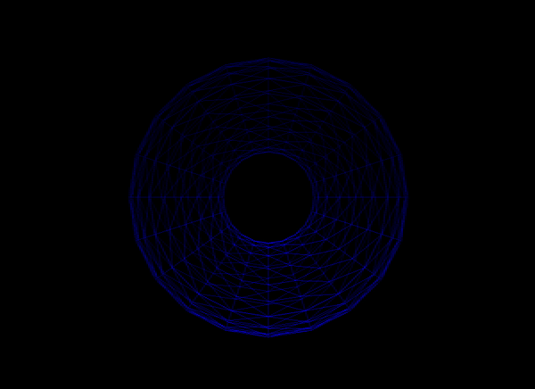
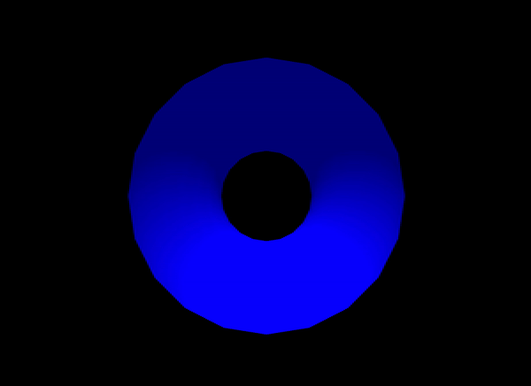
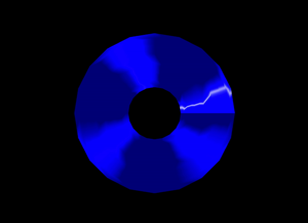
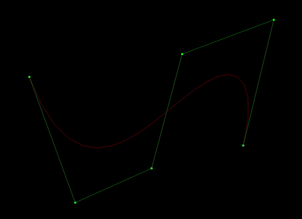
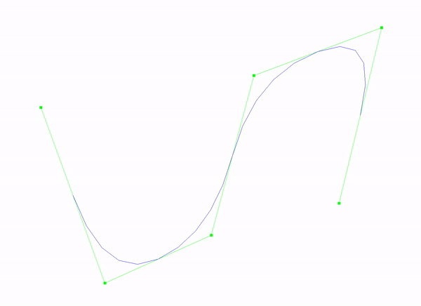

# Computer Graphics Fundamentals

### Geometric Modeling
<table style="padding:10px">
  <tr>
    <td height= "200px"> </td>
    <td height= "200px">
  </tr>
  
   <tr>
    <td><i>Parameterized Torus</i></td>
   <td><i>Scaling & Resampling</i></td>
  </tr>
</table>

### Shading and Illumination
<table style="padding:10px">
  <tr>
    <td height= "200px"> </td>
    <td height= "200px">
  </tr>
  
   <tr>
    <td><i>Smooth Shading</i></td>
   <td><i>Normals Visualization</i></td>
  </tr>
</table>

<table style="padding:10px">
  <tr>
    <td height= "200px"> </td>
    <td height= "200px">
  </tr>
  
   <tr>
    <td><i>Flat Shading</i></td>
   <td><i>Normals Visualization</i></td>
  </tr>

</table>

### Parametric Curves
<table style="padding:10px">
  <tr>
    <td height= "200px"> </td>
    <td height= "200px">
  </tr>
  
   <tr>
    <td><i>Bézier</i></td>
    <td><i>Quadratic B-Spline</i></td>
  </tr>
</table>
